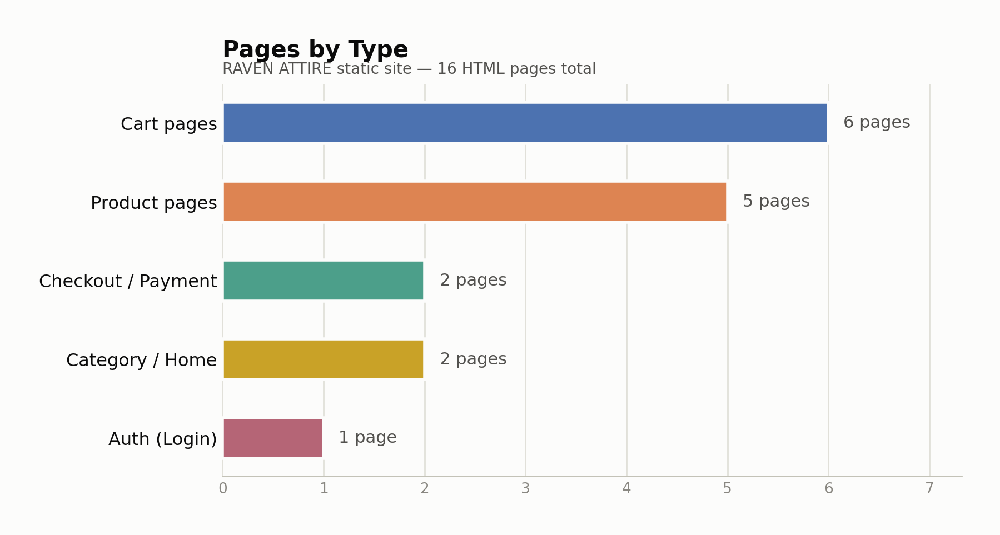
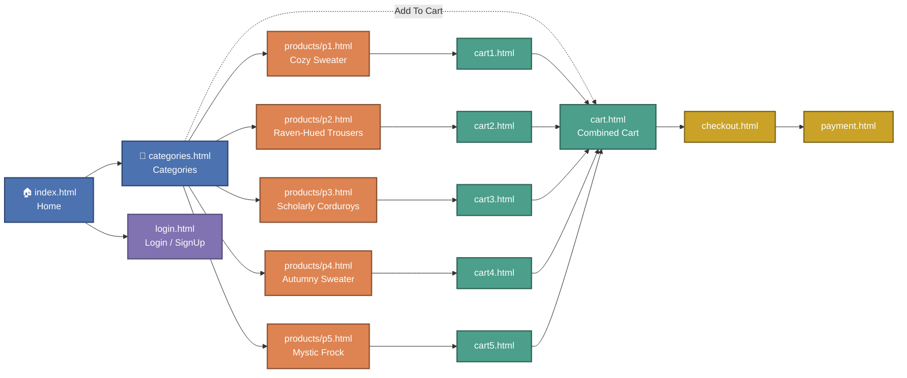

# 🧥 RAVEN ATTIRE — Clothing Store Website

*"Where style meets innovation."*

A static, no-JavaScript, no-backend website for a gothic/vintage-inspired clothing store — product pages, per-item cart pages, a checkout flow, and a payment form, all built with plain **HTML5** and **CSS3**.

**🌐 Live demo: [mina-hill.github.io/Clothing-Website](https://mina-hill.github.io/Clothing-Website/index.html)**


---

## 📊 Project at a Glance

The site is 16 static HTML pages in total: 5 product pages, 6 cart pages (one combined view + one per product), a checkout/payment pair, the category/home pages, and a login screen.

<picture>
  <source media="(prefers-color-scheme: dark)" srcset="docs/charts/pages-by-type-dark.png">
  
</picture>

---

## 🖼️ Gallery

Real product photography used across the category and product pages:

<table>
  <tr>
    <td align="center"><br><sub>Cozy Sweater</sub></td>
    <td align="center"><br><sub>Raven-Hued Trousers</sub></td>
    <td align="center"><br><sub>Scholarly Corduroys</sub></td>
    <td align="center"><br><sub>Autumny Sweater</sub></td>
    <td align="center"><br><sub>Mystic Frock</sub></td>
  </tr>
</table>

> Live screenshots of the deployed site weren't captured in this pass (browser preview tooling was unavailable) — the images above are the site's actual product photos from `clothes/`, not placeholders. You can browse the live pages directly at the [demo link](https://mina-hill.github.io/Clothing-Website/index.html) above.

---

## 🧭 Site Flow

Navigation is consistent across every page (Home / Categories / Payment / Login / Shopping Cart in the header). The real user journey through the pages looks like this:



- 🔵 **Browsing** — Home and Categories, the entry points into the catalog
- 🟠 **Product pages** — one static page per item, each showing related products
- 🟢 **Cart pages** — a dedicated cart page per product plus a combined cart view
- 🟡 **Checkout / Payment** — the two-step purchase flow
- 🟣 **Auth** — the login/sign-up screen, linked from the header on every page

---

## 📁 Project Structure

```
.
├── index.html               # Homepage
├── categories.html          # Lists clothing categories
├── login.html                # Login / sign-up page
├── cart.html                 # Combined cart view
├── cart1.html - cart5.html   # Cart pages for individual products
├── checkout.html              # Checkout interface
├── payment.html                # Payment interface
├── style.css                    # Main CSS file (theme accent: #81613b)
├── logo.png                      # Store logo
├── favicon.ico                    # Favicon
├── clothes/                        # Product photos, p1.png - p5.png
├── products/                        # Product detail pages, p1.html - p5.html
└── docs/charts/                      # README chart assets
```

---

## ✨ Features

- Clean homepage hero and "Why Choose Us" section
- Category page listing all 5 products with pricing
- 5 individual product pages (`products/p1.html`–`p5.html`) with size selectors and related-product suggestions
- Per-product cart pages (`cart1.html`–`cart5.html`) plus a combined cart (`cart.html`)
- Checkout and payment UI with a styled form
- Login/sign-up screen
- Consistent gothic/vintage styling driven by a single warm brown accent color (`#81613b`) across headers, buttons, cards, and the footer
- Fully responsive layout with breakpoints at 1400px, 1220px, 900px, 768px, and 570px

---

## 🚀 How to Run Locally

1. Clone the repository:
   ```bash
   git clone https://github.com/mina-hill/Clothing-Website.git
   cd Clothing-Website
   ```

2. Open `index.html` in your browser:
   - Double-click it, or
   - Right-click → *Open with* → your preferred browser

No build step, package manager, or server is required.

---

## 🛠️ Built With

- HTML5
- CSS3

> No frameworks, JavaScript, or backend logic included — every page here is plain markup and CSS.
