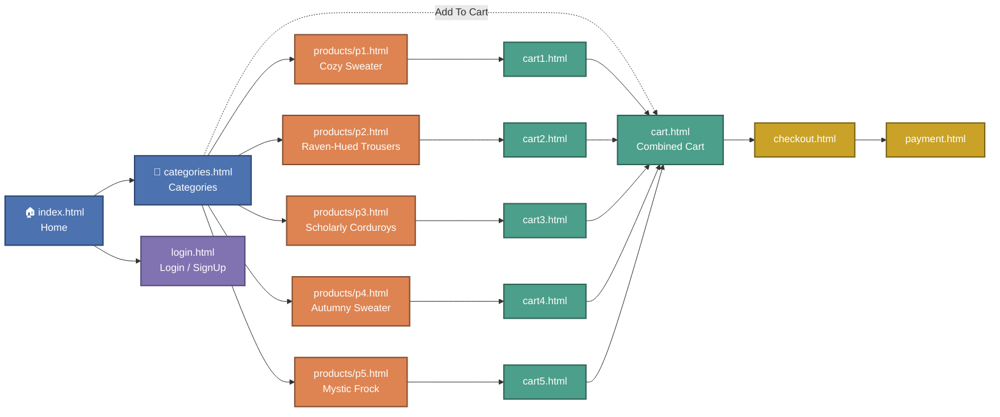

# 🧥 RAVEN ATTIRE — Clothing Store Website

*"Where style meets innovation."*

A static, no-JavaScript, no-backend website for a gothic/vintage-inspired clothing store — product pages, per-item cart pages, a checkout flow, and a payment form, all built with plain **HTML5** and **CSS3**.

**🌐 Live demo: [mina-hill.github.io/Clothing-Website](https://mina-hill.github.io/Clothing-Website/index.html)**


---

## 📊 Project at a Glance

The site is 16 static HTML pages in total: 5 product pages, 6 cart pages (one combined view + one per product), a checkout/payment pair, the category/home pages, and a login screen.

<picture>
  <source media="(prefers-color-scheme: dark)" srcset="docs/charts/pages-by-type-dark.png">
  
</picture>

---

## 🖼️ Gallery

Real product photography used across the category and product pages:

<table>
  <tr>
    <td align="center"><br><sub>Cozy Sweater</sub></td>
    <td align="center"><br><sub>Raven-Hued Trousers</sub></td>
    <td align="center"><br><sub>Scholarly Corduroys</sub></td>
    <td align="center"><br><sub>Autumny Sweater</sub></td>
    <td align="center"><br><sub>Mystic Frock</sub></td>
  </tr>
</table>

> Live screenshots of the deployed site weren't captured in this pass (browser preview tooling was unavailable) — the images above are the site's actual product photos from `clothes/`, not placeholders. You can browse the live pages directly at the [demo link](https://mina-hill.github.io/Clothing-Website/index.html) above.

---

## 🧭 Site Flow

Navigation is consistent across every page (Home / Categories / Payment / Login / Shopping Cart in the header). The real user journey through the pages looks like this:



- 🔵 **Browsing** — Home and Categories, the entry points into the catalog
- 🟠 **Product pages** — one static page per item, each showing related products
- 🟢 **Cart pages** — a dedicated cart page per product plus a combined cart view
- 🟡 **Checkout / Payment** — the two-step purchase flow
- 🟣 **Auth** — the login/sign-up screen, linked from the header on every page

---

## 📁 Project Structure

```
.
├── index.html               # Homepage
├── categories.html          # Lists clothing categories
├── login.html                # Login / sign-up page
├── cart.html                 # Combined cart view
├── cart1.html - cart5.html   # Cart pages for individual products
├── checkout.html              # Checkout interface
├── payment.html                # Payment interface
├── style.css                    # Main CSS file (theme accent: #81613b)
├── logo.png                      # Store logo
├── favicon.ico                    # Favicon
├── clothes/                        # Product photos, p1.png - p5.png
├── products/                        # Product detail pages, p1.html - p5.html
└── docs/charts/                      # README chart assets
```

---

## ✨ Features

- Clean homepage hero and "Why Choose Us" section
- Category page listing all 5 products with pricing
- 5 individual product pages (`products/p1.html`–`p5.html`) with size selectors and related-product suggestions
- Per-product cart pages (`cart1.html`–`cart5.html`) plus a combined cart (`cart.html`)
- Checkout and payment UI with a styled form
- Login/sign-up screen
- Consistent gothic/vintage styling driven by a single warm brown accent color (`#81613b`) across headers, buttons, cards, and the footer
- Fully responsive layout with breakpoints at 1400px, 1220px, 900px, 768px, and 570px

---

## 🎨 Design Language

The visual identity is simpler than the CSS file suggests — `style.css` declares a full nine-variable theme in `:root`, but only three of those variables are actually consumed anywhere in the stylesheet:

```css
:root {
  --main-color: #0062ff;          /* declared, never used */
  --supporting-color: #ebf3fe;    /* declared, never used */
  --font-color: #424242;          /* declared, never used */
  --bg-color: #f7fcff;            /* declared, never used */
  --heading-color: #000a19;       /* used once, on the login <h1> */
  --hero-heading-color: #003b99;  /* declared, never used */
  --white-color: #ffffff;         /* declared, never used */
  --para-color: #504e4d;          /* used — body copy color (p, li, a, label) */
  --bnt-hover-bg-color: #003b99;  /* declared, never used */
  --btn-box-shadow: rgba(100, 100, 111, 0.5) 0px 7px 29px 0px; /* used — soft elevation on ~6 buttons */
  --footer-bg-color: #040d12;     /* declared, never used — footer is hardcoded #81613b instead */
}
```

Everything you actually *see* — headers, hover states, footer, card borders, section dividers, form buttons — is driven by a single hardcoded brown, **`#81613b`**, repeated as a literal hex value more than 20 times across the file, with **`#422d20`** as its fixed darker hover/active shade. The blue palette in `:root` (`#0062ff`, `#003b99`, `#ebf3fe`) reads like the starting point of an earlier design that was re-skinned brown without ever cleaning out the unused custom properties — worth collapsing into `--accent-color: #81613b` and `--accent-hover: #422d20` if this is picked back up.

**Typography** is a two-font system that's declared but never delivered: the base rule sets `font-family: "Urbanist", sans-serif` for body text and `"Poppins", sans-serif` for all headings (`h1`–`h6`), but no page links a Google Fonts `<link>`, `@import`, or local `@font-face` anywhere in the repo. Every browser silently falls back to its default sans-serif, so in practice the whole site renders in one generic system font, not the two-typeface hierarchy the CSS implies. The type scale itself is a rem-based system off a root `font-size: 62.5%` (i.e. `1rem = 10px`), stepped down at each breakpoint (`56.25%` → `54%` → `50%`) so the whole layout shrinks proportionally instead of individual elements being resized.

**Recurring components** and how consistently they're applied:

| Component | Pattern | Consistency |
|---|---|---|
| Buttons | `background: #81613b`, white text, `2px solid #422d20` border, `border-radius: 8px`, darkens to `#422d20` on hover | Global `button`/`button:hover` rule at the bottom of the file — applies everywhere *except* one leftover rule under `article` that paints buttons mint-green (`rgb(155, 255, 152)`) instead, a stray remnant that only affects the malformed `<article>` markup inside `cart.html` (see Known Issues) |
| Cards (`.item-card`) | Fixed `30rem × 55rem` box, grey border, `var(--btn-box-shadow)`, corners round to `35px` on hover with a brown shadow accent | Consistent across `categories.html` and each product page's "related products" strip |
| Nav header | Logo left, five-item nav right (Home / Categories / Payment / Login / Shopping Cart), links underline in `#81613b` on hover | Identical markup on every page, though only `index.html` and `categories.html` wrap the logo in an `<a>` back to home — the rest leave it as a bare `` |
| Forms | Underline-style inputs (`border-bottom` only) on login/cart-adjacent pages vs. boxed inputs with `border-left`/`border-bottom` + `10px` radius on the payment form | Two different input styles for the same site, never unified |
| Dead CSS | A commented-out ~35-line alternate `.item-card` (teal gradient image, "20% Off" badge) and a whole unused `.form-main` block (payment-style form styling that no page's class names actually match) | Both still shipped in `style.css`, adding weight with no effect |

---

## 🧵 Page-by-Page Walkthrough

**Home (`index.html`)** — Header/nav, a hero (`bg-main`) with the "RAVEN ATTIRE" heading, a one-line welcome sentence, a "Wanna Shop" button linking to `categories.html`, and a hero image (`image.png`). Below it, a single "Why Choose Us" bullet ("Quality Craftsmanship") sits inside a `<ul>` built to hold more list items that were never added. Nothing on this page is interactive beyond plain navigation links.

**Categories (`categories.html`)** — A grid of all 5 products, each card showing a photo, name, price, and an "Add To Cart" button. Every card's "Add To Cart" is a plain `<a href="cartN.html">` — there's no product ID passed anywhere; it just navigates to that product's pre-written static cart page.

**Product page (`products/p1.html`–`p5.html`)** — Two-column layout: a large product photo on the left, and on the right a "Back to categories" button, product name (rendered with an unclosed `<h3>` tag on every product page — `<h3>Cozy Sweater<h3>` instead of `</h3>`), price, a row of five size buttons (XS/S/M/L/XL — plain `<button>` elements with no selected/active state, since there's no JS or `:checked` radio hack behind them), a one-line description, and an "Add to cart" link to that product's cart page. Below the fold, a "related products" strip repeats the other four items as mini cards. All five product pages are near-identical copies with only the image, name, price, description, and related-product links swapped in.

**Per-product cart (`cart1.html`–`cart5.html`)** — The simplest cart view: header, one line item (image, name, price, a `Qty: 1/-&nbsp;+` string), a "Remove" button, a summary block with a hardcoded total, and "Proceed to Checkout" linking to `payment.html`.

**Combined cart (`cart.html`)** — Lists all 5 products as separate line items with individually hardcoded quantities (Qty 1, 1, 2, 2, 2) and a summary claiming "Total items: 5" and "Total: Rs.33,597" — see Known Issues below, since neither number is actually derived from the line items shown.

**Payment (`payment.html`)** — A two-column form: "Personal Details" (name, email, address, city, country, zip — all plain `<input type="text">`, no `required`, no `name` attributes, and every field's wrapper div has a typo'd `clas="inputBox"` instead of `class=`, so none of the `.form-main .input` styling in `style.css` ever reaches these fields) and "Payment Details" (an accepted-cards image, card number, expiry month/year, CVV — using `<input type="number">`, which lets a browser's spinner arrows sit on top of a 16-digit card number). A "Checkout" button links to `checkout.html`. No total, no order summary, and no validation of any kind appear on this page.

**Checkout (`checkout.html`)** — The simplest page in the whole site: a checkmark-style image and the static line "You have successfully checked out." It does not read, compute, or display anything from the cart or payment form — it's reached the same way whether the cart had one item or five, or whether the payment form was filled in at all.

**Login (`login.html`)** — Email + password fields (with native HTML5 `required`, the only validation anywhere on the site) and a submit button styled only with a box-shadow. There is no sign-up form despite the nav link reading "Login/SignUp" on every page except the homepage's own nav, which just says "Login".

---

## 🔍 Known Issues & Future Improvements

Since there is no JavaScript or backend anywhere in the repo, everything described below was verified by reading the actual markup, not assumed from the "no JS" badge:

- **"Add to Cart" does nothing to a cart.** Every Add to Cart control, on `categories.html`, on the product pages, and in the related-products strips, is a plain anchor (`<a href="cartN.html">`) to a pre-written static page. No item is actually added anywhere — you're just navigating to a page that happens to already show that one product.
- **Quantity controls are decorative text, not buttons.** The `-` and `+` next to "Qty" in every cart page are literal characters inside a `<p>` (`Qty: 1/-&nbsp;+`), not clickable elements. Quantities can't be changed from the UI at all.
- **"Remove" buttons are inert.** Each cart line's `<button>Remove</button>` has no `onclick`, isn't inside a `<form>`, and has no default type semantics to fall back on — clicking it does literally nothing.
- **The combined cart's total is wrong for the quantities it displays.** `cart.html` shows Cozy Sweater ×1 (Rs.5000), Raven-Hued Trousers ×1 (Rs.5999), Scholarly Corduroys ×2 (Rs.20,000), Autumny Sweater ×2 (Rs.9998), and Mystic Frock ×2 (Rs.15,198) — which sums to **Rs.56,195**, not the "Rs.33,597" the summary displays. The "Total items: 5" line also counts distinct product rows, not the 8 total units implied by the quantities shown. Both figures are hardcoded strings, not a computed sum.
- **Checkout doesn't check anything out.** `checkout.html` is a static success message; it doesn't read cart contents, doesn't total the payment form, and is reachable (and shows the identical "success") regardless of what, if anything, was in the cart or typed into `payment.html`.
- **Size buttons (XS–XL) don't select.** They're plain buttons with no active/selected state — there's no way to tell, visually or in the markup, which size (if any) a shopper picked.
- **Payment form fields are unstyled due to a typo.** Every `<div>` wrapping a payment input uses `clas="inputBox"` instead of `class=`, so the matching `.form-main .input` CSS rules never apply, and the fields fall back to bare browser defaults. Card number and CVV also use `<input type="number">`, which adds unwanted spinner arrows and would strip any leading zero a real card/CVV could have.
- **No form validation anywhere except login.** `login.html`'s email/password fields use HTML5 `required`; `payment.html` has no `required`, `name`, `type="email"`/`pattern`, or `maxlength` attributes at all, so it can be "submitted" (there's no working submit action) completely empty or with garbage input.
- **The favicon link 404s on every top-level page.** `index.html`, `categories.html`, `login.html`, `cart.html`, and `cart1.html`–`cart5.html` all include `<link rel="shortcut icon" href="Images.png">`, but no file with that exact name/casing exists in the repo (only lowercase `image.png` and `images.png`) — since GitHub Pages serves from a case-sensitive Linux filesystem, that request fails outright. A second, correct `<link rel="icon" href="logo.png">` on the same pages likely masks the problem visually, but the dead link is still shipped everywhere; the `products/p*.html` pages don't even include the broken tag, so the templates aren't consistent with each other.
- **`cart.html` has malformed HTML.** Three `<article>` tags are opened and never closed, and the Autumny Sweater line item is missing the closing `</div>`/Remove-button markup that every other line item has — browsers will auto-correct the nesting, but which elements end up inside which `<article>` (and therefore which pick up the stray green button rule mentioned in Design Language) is effectively undefined behavior.
- **Dead CSS ships to production.** A ~35-line commented-out alternate `.item-card` style and an entire unused `.form-main`/`.input` block (styled for class names no page actually uses) add weight to `style.css` with zero visual effect.

**Sensible next steps, roughly in order of impact:**
1. **localStorage-based cart** — replace the five static `cartN.html` pages and the hardcoded combined cart with one real cart page driven by `localStorage`, so Add to Cart, quantity +/-, and Remove actually mutate state and the total is computed, not typed in by hand.
2. **A minimal backend (or a serverless form endpoint)** — to actually accept `payment.html`'s submission, generate an order reference, and let `checkout.html` display a real summary (items, total, order number) instead of a static sentence.
3. **Form validation** — add `required`, `type="email"`, `pattern`/`maxlength` for the card number and CVV, and real `<label for>` associations (the payment form currently uses bare `<span>` text, not `<label>`, so screen readers can't associate the text with its input).
4. **Fix the markup bugs above** — the unclosed `<h3>` on every product page, the `clas=` typo on every payment field, the malformed `<article>` nesting in `cart.html`, and the case-mismatched favicon link — before adding any new functionality, since some of the CSS/JS work planned above would otherwise inherit these bugs.
5. **Either load the declared fonts or drop them from the CSS** — right now "Urbanist"/"Poppins" are pure documentation of an intended look the browser never renders.

---

## 🚀 How to Run Locally

1. Clone the repository:
   ```bash
   git clone https://github.com/mina-hill/Clothing-Website.git
   cd Clothing-Website
   ```

2. Open `index.html` in your browser:
   - Double-click it, or
   - Right-click → *Open with* → your preferred browser

No build step, package manager, or server is required.

---

## 🛠️ Built With

- HTML5
- CSS3

> No frameworks, JavaScript, or backend logic included — every page here is plain markup and CSS.
